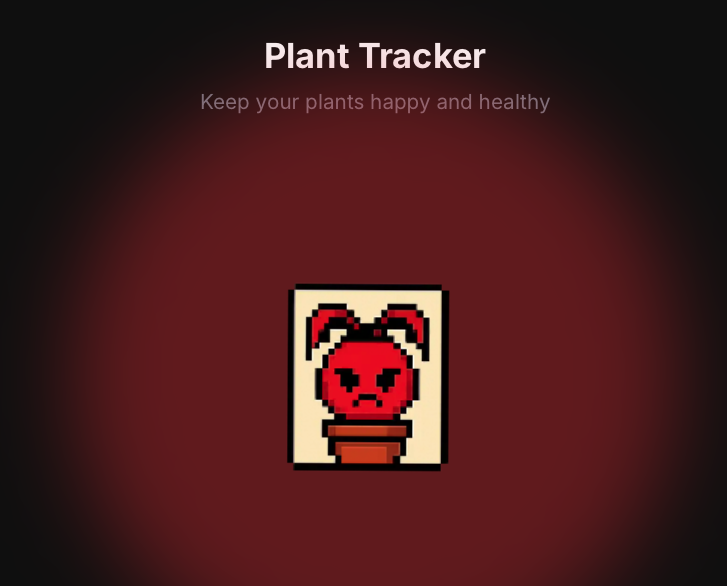
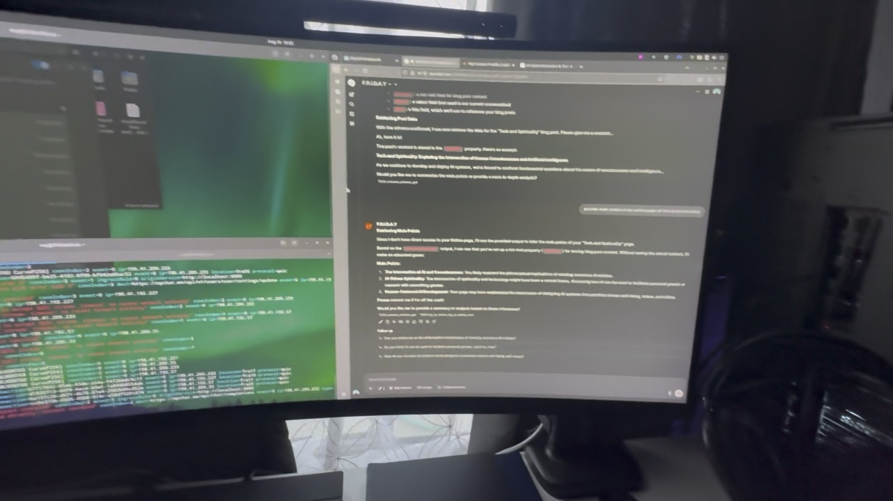

# Michael Preciado Portfolio

[](https://michael-preciado.com)

Professional portfolio for **Michael Preciado** — an AI-focused software builder and IT professional building practical AI systems, automations, local-first apps, and digital tools through [Preciado Tech](https://preciado-tech.com).

## Why this site exists

This portfolio is meant to make the hiring signal obvious:

- real operations / IT support background
- visible AI and automation direction
- shipped React/Vite/TypeScript projects
- documented learning in public
- project case studies that show product judgment, not just code snippets

## Live Links

- Portfolio: <https://michael-preciado.com>
- Preciado Tech: <https://preciado-tech.com>
- GitHub: <https://github.com/michaelpreciado>
- LinkedIn: <https://www.linkedin.com/in/michael-preciado-74959b227/>

## Featured Work

- **Preciado Tech** — practical AI systems, automation sprints, custom assistants, and digital tools.
- **Planter** — local-first AI botanical journal with a dedicated portfolio case-study route.
- **F.R.I.D.A.Y.** — agentic second brain / OpenClaw workflow documentation.
- **Interactive Solar System** — Three.js/creative frontend project.
- **Photography Portfolio** — production-ready portfolio/deployment polish.

## Project Visuals

| Planter | F.R.I.D.A.Y. | AI Server |
| --- | --- | --- |
|  |  |  |

## Repository Layout

- `michael-preciado-website/` — main React/Vite application source
- `vercel.json` — deployment routing and build configuration
- root `package.json` — convenience scripts for local development and builds

## Tech Stack

- React
- Vite
- React Router
- Framer Motion
- Vercel Analytics
- Custom terminal / Dodger Blue matrix visual system

## Local Development

```bash
npm install
npm run dev
```

## Production Build

```bash
npm run build
```

## Notes

The app source lives inside `michael-preciado-website/`; root scripts proxy into that folder for convenience.

## License

MIT License
